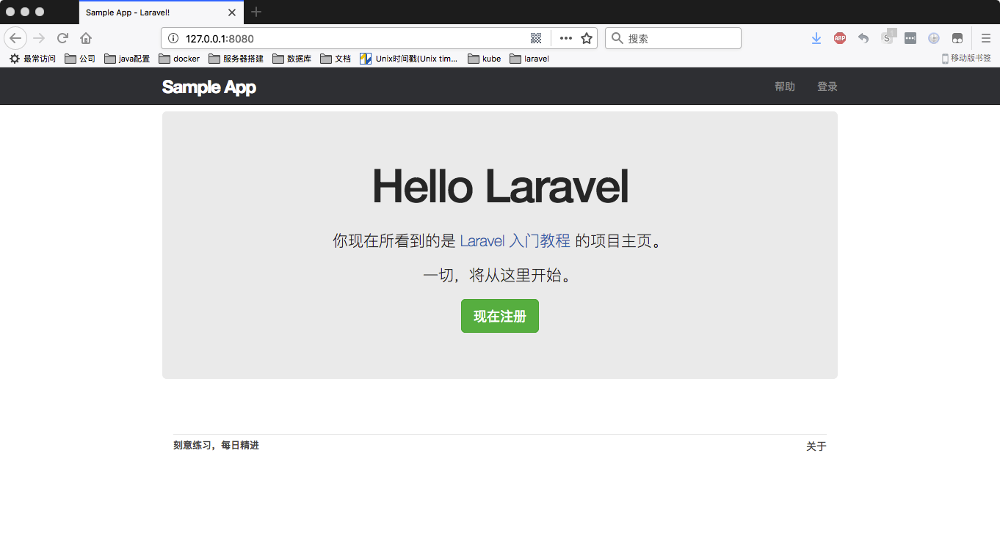

# BBS-Demo

laravel 5.2框架学习，docker搭建开发环境。

# 准备

安装的软件及版本:
- docker for mac version 17.06.2-ce, build cec0b72
  
  参照 http://www.runoob.com/docker/macos-docker-install.html
- docker-compose version 1.14.0, build c7bdf9e
  ```bash
  $ curl -L https://github.com/docker/compose/releases/download/1.14.0/docker-compose-`uname -s`-`uname -m` > /usr/local/bin/docker-compose && chmod +x /usr/local/bin/docker-compose # 安装docker-composer
  $ docker-compose -v # 查看版本信息
  docker-compose version 1.14.0, build c7bdf9e
  ```
# 本地运行

```bash
$ mkdir -p ~/Laravel && cd ~/Laravel
$ git clone https://github.com/reminz/bbs-demo.git
$ cd bbs-demo
$ docker-compose up
```
浏览器访问[sampleapp主页](127.0.0.1:8080)。

# 附加说明
### 环境变量

       laravel框架会先尝试读取系统的环境变量，之后再尝试.env文件定义的环境变量。docker只为laravel的http请求提供运行环境，命令行操作是在电脑上执行的。因此，在docker-compos.yaml文件里面定义的env是为http请求提供的，.env定义的变量是为laravel artisan 提供的，两者的作用范围是有差异的。
       因此在docker-compose.yaml里dbhost为“db”(即docker-compose文件定义的service：db),dbport为3306。
       而.env内的dbhost为127.0.0.1，dbport为3307，因为docker将创建的db service端口3306映射到本地电脑的3307端口。

### 创建数据库

不使用本地电脑上的mysql，而是docker创建的dbservice，首先需要创建对应的database，laravel才能够使用。重新打开一个终端，执行以下命令：
  ```bash
  $ cd ~/Laravel/bbs-demo
  $ docker-compose exec db /bin/bash
  $ mysql -u root -p
  Enter password: # 输入密码（docker-composer.yaml里db部分environment中的MYSQL_ROOT_PASSWORD对应的值）
  Welcome to the MySQL monitor. #(成功登陆数据库)
  ...

  mysql> create database sampleapp; 
  Query OK, 1 row affected (0.07 sec) # 成功创建数据库sampleapp
  mysql>exit # 退出数据库
  $ exit #退出docker container
  ```
> note: docker创建的db service会将数据库数据保存在misc/database下使数据库数据持久化，确保不用每次启动都要重新创建数据库，并执行migrate操作。